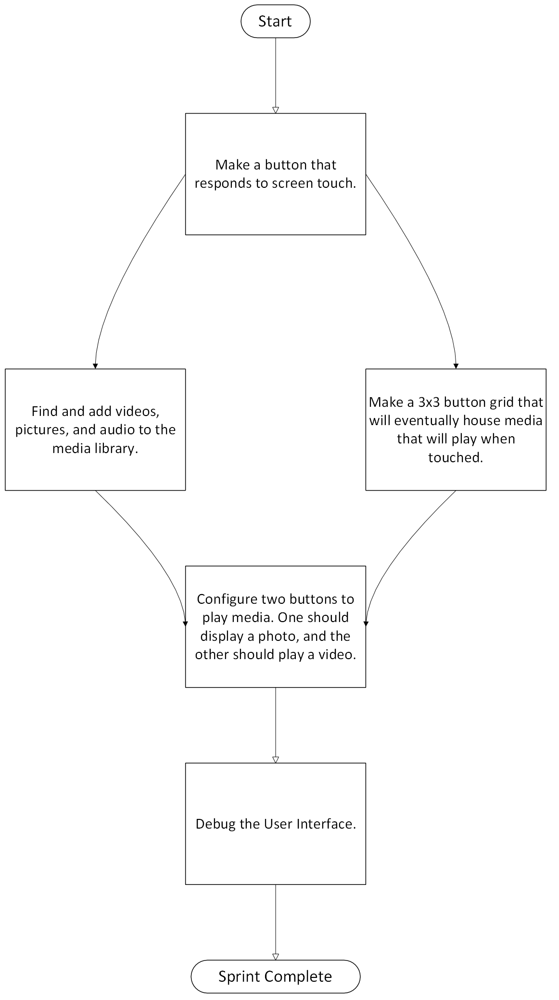

# Children'sTherapy

## Purpose:

This project will have a libary of buttons corresponding to different objects
that kids can press to see a short video of the object as a reward. This is to
assist in children't therapy efforts and ideally it should be able to easily
expand the libary

## Design Plan

The stakeholder has tasked the design team to a three-week sprint with the goal
of creating a 3x3 grid of buttons for an Android touchscreen tablet that will 
contain various objects.  Upon touching either of the buttons, the tablet will 
either play a video, play an audio file, or display an image.

The design team consists of three members, each of whom will be delegated specific 
tasks, rotating tasks each week.  

The three tasks are:
1. Write the code.
2. Find videos and images to place in the file directory of the app.
3. Write documentation.

## This is the working design chart

# 

## Summary of Progress

1. A 3x3 button grid has been created, which can be found in the activity_main.xlm
2. Audio and video files, as well as a link to a YouTube video has been added.
3. An ActivityMain.kt program has been created which links the buttons in the activity_main file to ActivityMain.kt
4. Documentation within ActivityMain.kt has been written, providing an overview of Kotlin and an explanation of how the program works.
5. The application has been tested on an Android device and works.

## How to Use
1. Clone the repository: https://github.com/dh2540/Children-sTherapy
2. Go to file>Open Folder> and choose directory: Children-sTherapy/childrensTherapy3
3. Expand the file manager to the left of the screen on Android Studio and go to the directory to open MainActivity.kt: childrensTherapy3\app\src\main\java\com\example\childrenstherapy3\MainActivity.kt
4. Open activity_main.xml in Android Studio found in the following directory: childrensTherapy3\app\src\main\res\layout\activity_main.xml
6. Read documentation in MainActivity.kt for an overview of the project.
